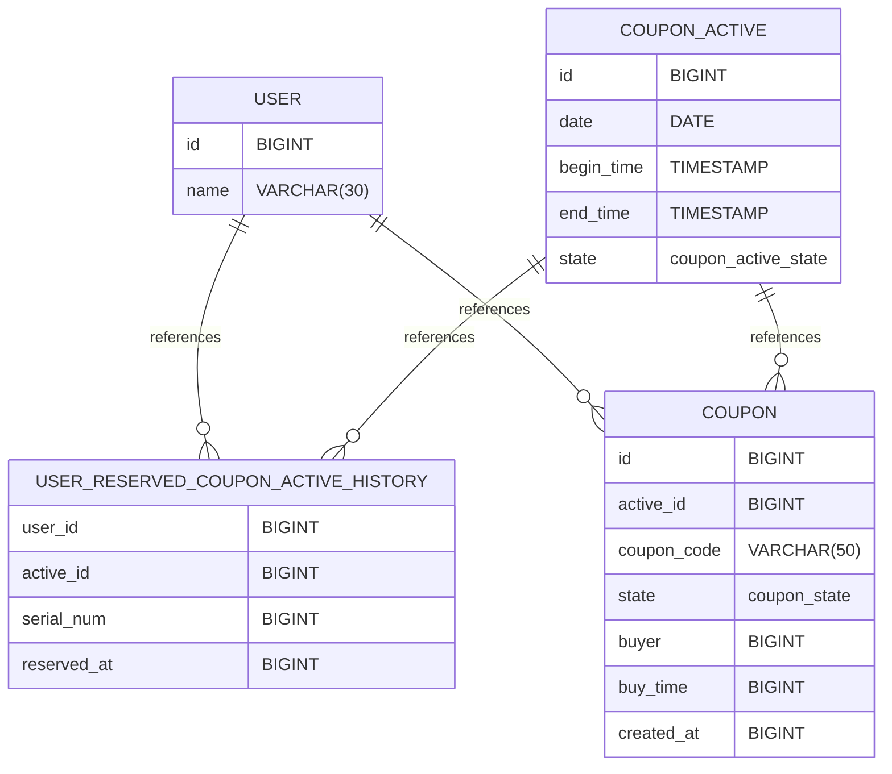

# CouponRushSystem
===

# 題目

設計一套搶購機制，規格：

1. 每天定點23點發送優惠券，需要用戶提前1-5分鐘前先預約，優惠券的數量為預約用戶數量的20%，
2. 搶購優惠券時，每個用戶只能搶一次，只有1分鐘的搶購時間，怎麼盡量保證用戶搶到的概率盡量貼近20%。
3. 需要考慮有300人搶和30000人搶的場景。
4. 設計表結構和索引、編寫主要程式碼。

# 交付時限/方式

- [ ]  題目送出後 7 天內
- [ ]  交付方式不限，可以是 Github, 也可以是 PDF.


# 設計

## 預約發放優惠卷 

每個優惠卷預約活動都有個active_id, 使用者要申請預約要告知預約哪場活動。

開放時間為每日 22:55 - 22:59 , 給用戶進行預約活動的登記; 其他時間一率回應 `403` Forbidden.

用redis bitmaps, key 是 `coupan_active_YYYYMMDD`, 將user id 對應的bit設置為1. 這樣有沒有預約過就會知道. key採用今天日期.  user id太長超過2^32次方再來煩惱.

再來使用取號機`reserve_active_amount_20060102`, 每個預約成功請求給個 `預約號碼牌`數量 ; 因為優惠卷數量是預約人數的 20%, 所以每取號5張(或每次取號牌尾數是0) 就即時產生一組優惠卷號碼於 redis.
`coupons__YYYYMMDD`

並發送一筆**已預約成功**的事件給Message Broker。


## 搶購優惠卷

已預約成功的用戶, 可以在 23:00 - 23:01 進行搶購優惠卷的行為; i.e. 一分鐘內的秒殺搶購流量大量湧入.

用戶搶購請求進來, 首先要驗證是否是已預約成功的用戶.(思考, 有沒有可能不用去資料庫驗證, 而靠簽章驗證是已預約成功; 有困難, 搞不好用戶登出過或換裝置);
用 user id 查找redis bitmaps.

已預約成功的用戶, 按照請求順序依序購買到優惠卷; 換句話說比較慢進來搶購的用戶可能就買不到了. (避免超賣問題).購買成功則登記於redis bitmaps `coupan_purchased_YYYYMMDD`, 將user id 對應的bit設置為1，可避免同一個用戶多次購買。並且新增一筆購買成功紀錄於 `coupan_purchased_history_YYYYMMDD` 的list中。

並發送一筆**已購買成功**的事件給Message Broker。
再有一些consumer, prefetch能多點, 來同步這些event 到資料庫並更新狀態


**TODO** . 當有用戶請求發現已經沒優惠卷了, 此時 應用程式內的 flag 可以改成 `售完`. 以快速回應客戶搶購請求, 也避免給資料庫壓力.


購買優惠卷 solutions:

1. 於Postgres中 , 因為能請求的已經是有預約成功的用戶了, 可以篩選掉大部分無意義的搶購請求.
```
tx.Begin()

UPDATE coupon SET buyer=$user_id , status=reserved WHERE status=unreserved LIMIT 1 returning id;

if id > 0 {
    // insert a record to reserved_coupon  table with user id and coupon id
} else {
    // update flag state in memory
}

tx.Commit()
```

1. 於Redis中，採用Lua, 將多個操作以atomic的事務形式來確保都完成不會中間被其他操作插隊。


## HTTP Status

403 Forbidden


## Busniess Error Codes

NOT_IN_ACTIVE_TIME

ERROR_DUPLICATED_RESERVATION 

NOT_RESERVATION


## DB Data Schema
```
-- User table
CREATE TABLE public.user (
    id BIGINT  NOT NULL PRIMARY KEY,
    name VARCHAR(30) NOT NULL
);

-- Coupon activaty
CREATE TYPE coupon_active_state AS ENUM ('NOT_OPEN', 'OPENING', 'CLOSED');

CREATE TABLE coupon_active (
    id BIGINT NOT NULL PRIMARY KEY,
    date Date NOT NULL,
    begin_time TIMESTAMP WITHOUT TIME ZONE NOT NULL,
    end_time TIMESTAMP WITHOUT TIME ZONE NOT NULL,
    state coupon_active_state NOT NULL
);

-- history about user reserve coupon
CREATE TABLE user_reserved_coupon_active_history (
    user_id BIGINT NOT NULL,
    active_id BIGINT NOT NULL,
    serial_num BIGINT NOT NULL,
    reserved_at BIGINT,
    PRIMARY KEY (user_id, active_id),
    FOREIGN KEY (user_id) REFERENCES public.user (id),
    FOREIGN KEY (active_id) REFERENCES public.coupon_active (id)
);

CREATE TYPE coupon_state AS ENUM ('UNRESERVED', 'RESERVED', 'USED');

-- Coupon table
CREATE TABLE coupon (
    id BIGINT PRIMARY KEY,
    active_id BIGINT,
    coupon_code VARCHAR(50) NOT NULL,
    state coupon_state NOT NULL,
    buyer BIGINT,
    buy_time BIGINT,
    created_at BIGINT NOT NULL,
    FOREIGN KEY (active_id) REFERENCES public.coupon_active (id),
    FOREIGN KEY (buyer) REFERENCES public.user (id)
);
```



# System Componets


